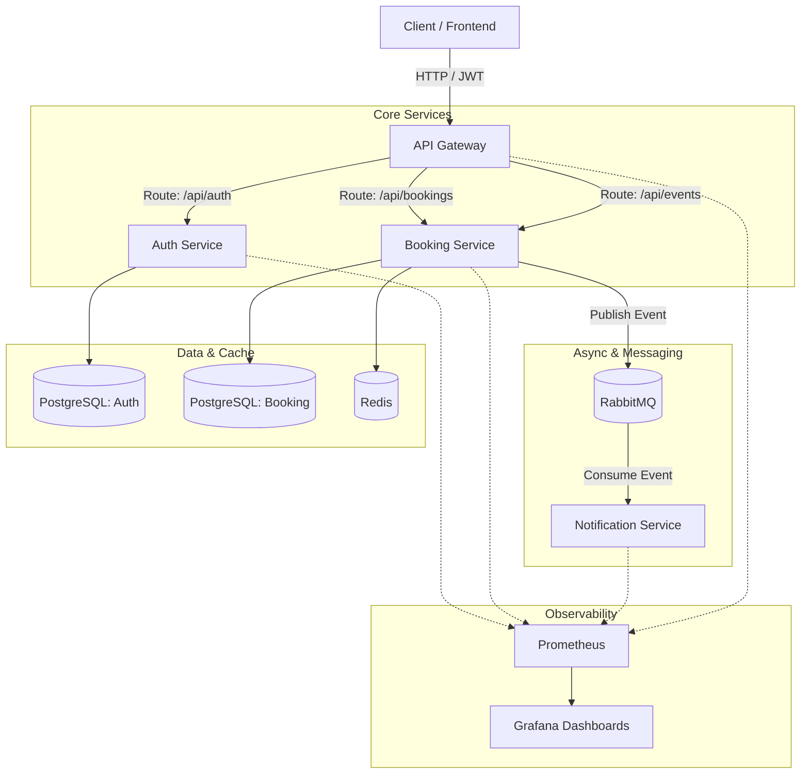

# Flash Sale Platform

A production-grade, distributed microservices architecture designed to handle high-concurrency ticket booking (flash sales). Built with **Spring Boot 4**, **Java 21**, and modern cloud-native practices.


## Arquitectura del sistema



## Características principales

- **Seguridad ante alta concurrencia:** Evita las reservas duplicadas mediante una combinación de bloqueo pesimista 
(SELECT FOR UPDATE) y bloqueo optimista (@Version) en PostgreSQL.
- **Desacoplamiento basado en eventos:** Las reservas exitosas publican eventos en RabbitMQ, permitiendo que el Servicio 
de Notificaciones procese las confirmaciones de forma asíncrona sin bloquear la respuesta HTTP.
- **Seguridad centralizada:** Spring Cloud Gateway actúa como único punto de entrada, validando los JWT e inyectando el 
contexto del usuario (X-User-Id, X-User-Role) en los servicios posteriores.
- **DevOps preparado para producción:** Compilaciones Docker en múltiples etapas, ejecución con un usuario sin privilegios 
(non-root) y un pipeline automatizado de CI/CD con GitHub Actions para realizar pruebas y compilaciones.
- **Observabilidad:** Exposición completa de métricas mediante Micrometer/Prometheus y preparación para trazabilidad 
distribuida con OpenTelemetry.

## Tecnologías utilizadas

| Categoría      | Tecnología                             |
|----------------|----------------------------------------|
| Lenguaje       | Java 21                                |
| Framework      | Spring Boot 4, Spring Cloud Gateway    |
| Seguridad      | Spring Security, JJWT                  |
| Datos          | PostgreSQL 16, Flyway, Spring Data JPA |
| Mensajería     | RabbitMQ (AMQP)                        |
| Caché          | Redis                                  |
| DevOps         | Docker, Docker Compose, GitHub Actions |
| Observabilidad | Prometheus, Grafana, OpenTelemetry     |

## Cómo ejecutar

La forma más sencilla de ejecutar toda la plataforma localmente es utilizando Docker Compose.

### 1. Clonar el repositorio

```bash
git clone https://github.com/lfw000/flash-sale-platform.git
```

```bash
cd flash-sale-platform
```

### 2. Iniciar la infraestructura

Esto inicia PostgreSQL (x2), Redis, RabbitMQ, Prometheus, Grafana y el Collector de OpenTelemetry.

```bash
docker compose up -d
```

### 3. Compilar y ejecutar los servicios

Puedes ejecutar los servicios localmente mediante Maven. Estos se conectarán a la infraestructura que se está 
ejecutando mediante Docker:

```bash
# Terminal 1: Servicio de autenticación
./mvnw spring-boot:run -pl auth-service

# Terminal 2: Servicio de reservas
./mvnw spring-boot:run -pl booking-service

# Terminal 3: Servicio de notificaciones
./mvnw spring-boot:run -pl notification-service

# Terminal 4: API Gateway
./mvnw spring-boot:run -pl gateway
```
### 4. Probar el flujo

- ### 1. Registrar un usuario mediante el Gateway

```bash
curl -X POST http://localhost:8080/api/auth/register \
-H "Content-Type: application/json" \
-d '{"email":"test@example.com","password":"password123","firstName":"John","lastName":"Doe"}'
```

- ### 2. Iniciar sesión para obtener un JWT

```bash
TOKEN=$(curl -s -X POST http://localhost:8080/api/auth/login \
-H "Content-Type: application/json" \
-d '{"email":"test@example.com","password":"password123"}' | grep -o '"token":"[^"]*"' | cut -d'"' -f4)
```

- ### 3. Reservar un boleto (ruta protegida)

```bash
curl -X POST http://localhost:8080/api/bookings \
-H "Content-Type: application/json" \
-H "Authorization: Bearer $TOKEN" \
-d '{"eventId": 1, "quantity": 1}'
```

## Observabilidad

- **Panel de Grafana:** http://localhost:3000/ (admin / admin)
- **Métricas de Prometheus:** http://localhost:9090/
- **Administración de RabbitMQ:** http://localhost:15672/ (guest / guest)

## Pipeline de CI/CD

Este repositorio utiliza GitHub Actions para garantizar la calidad del código en cada push:

- Valida la compilación con Java 21.
- Ejecuta la suite completa de pruebas (mvn clean verify).
- Construye imágenes Docker seguras y en múltiples etapas para todos los microservicios.

Ver el pipeline: https://github.com/lfw000/flash-sale-platform/actions